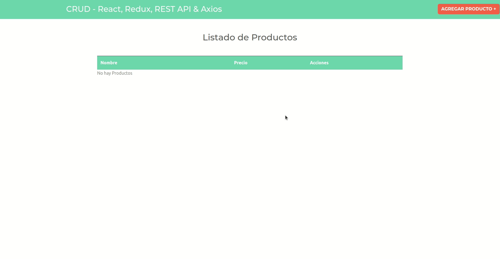

# App de CRM Clientes

App elaborada con la librería React, con la finalizadad de demostrar la utilizacion del hook Redux con la anipulacion del State global mediante la ejecución de diferentes actions. Además se recurrió a la libreria JSON-Server para permitir disponer de una base de datos local simulando las peticiones a un BackEnd.
La App permite añadir productos con descripcion y precio donde podrán visalizarse en un listado general. Cada producto puede modificarse y eliminarse, cambios que impactan en la base de datos y en el state gracias a Redux. Se incluyó modales informativos brindados por la libreria SweetAlert2. El formulario también cuenta con validación y mensaje de alerta, manipulado desde el state.

## Video Demo

## Ejecutando este Proyecto

1. Abre la terminal de Git
2. Cambia el directorio de trabajo actual a la ubicación en donde quieres clonar el directorio.
   `cd proyecto`

3. Escribe git clone seguido de la [URL](https://github.com/emanuelheredia/CRUD---React-Redux-REST-API-Axios) del proyecto

`git clone https://github.com/emanuelheredia/CRUD---React-Redux-REST-API-Axios `

4. Presiona Enter para crear tu clon local

    > $ git clone https://github.com/YOUR-USERNAME/YOUR-REPOSITORY
    > Cloning into `Spoon-Knife`...
    > remote: Counting objects: 10, done.
    > remote: Compressing objects: 100% (8/8), done.
    > remove: Total 10 (delta 1), reused 10 (delta 1)
    > Unpacking objects: 100% (10/10), done.

5. Instalar todas las dependencias necesarias dentro del directorio del proyecto
   `npm install`

6. Por último inicia el proyecto con npm start donde se iniciará el dashboard de expo en el navegador
   `npm start`

# Mis Redes :

-   [GITHUB](https://github.com/emanuelheredia)
-   [LINKEDIN](https://www.linkedin.com/in/emanuel-heredia-41749421a/)
